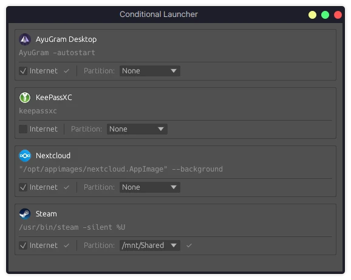

# conditional-launcher

## Description

Simple Rust (btw) GUI application, which will autostart apps after boot on
**your** conditions.

## Personal example of usage

I created this app to have universal and convenient way across my systems to:

- Launch Nextcloud and messengers only if there is internet connection
- Launch Steam only when disk with games is mounted

Why would I need them if conditions aren't met yet? They waste resources!

## Features

- Portable, no ads, no bs, no electron, etc. Just single binary and configs.
- Launch app if there is internet connection and/or there is partition mounted.
  Other conditions incoming based on demand (i.e. delay after system boot).
- Currently tested on x64 KDE Wayland. Others (MacOS/Windows/arm) incoming.
- Thiking to add restart apps via cron or other systems alternatives
- Dark theme, minimalistic style
- Automatically adds to your user autostarts and removes if not needed. Auto-
  closes when it done its job.



## Installation

To download and install the latest release for x86_64 Linux, run the following
command. This will place the binary in `~/.local/bin`.

```bash
curl -L https://github.com/Mayurifag/conditional-launcher/releases/latest/download/conditional-launcher-linux-x86_64 -o ~/.local/bin/conditional-launcher && chmod +x ~/.local/bin/conditional-launcher && ~/.local/bin/conditional-launcher
```

## Roadmap

- Migrate from `egui` to [something using *retaining* mode](https://github.com/emilk/egui?tab=readme-ov-file#why-immediate-mode). Use Dracula colors
- Add macos functionality
- Add custom commands functionality. Add possibility to cron them.
- Is it possible to contain all needed info in autostart shortcut across all
  systems?
- Release cargo and think about simpler installation (brew/aur?)
